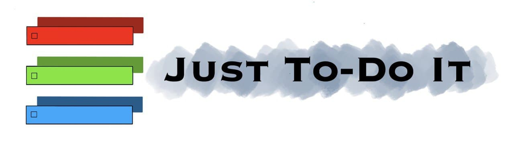

<p align="center"></p>

<h1 align="center">Just To-Do It</h1>

<div align="center">

</div>

<h3 align="center">A todo manager built for CVWO</h3>
<br/>

# Getting started with local development

After cloning the parent repository you should set up environment variables for both frontend and backend submodules.

## Environment Variables

This project makes use of `.env` file to store environment variables. To get started create a .env file and type this line in to the file. Be sure to replace the backend url with your backend url.

```
REACT_APP_BACKEND_URL = <YOUR-BACKEND-URL-HERE>
```

### `yarn install`

You can run the command above to install all project dependencies

### `yarn start`

This will launch the puma web server. By default, this will run at [http://localhost:3000/](http://localhost:3000/)

### `yarn build`

When you are done you can run the command above to let react optimise the code for production.

## Features

To learn more about Just To-Do It features you can click [here](https://github.com/sivayogasubramanian/just-to-do-it/blob/main/final-assignment-submission/just-to-do-it-user-guide.pdf).

## Frameworks Used

<br/>
Done with:

<br/>
<p align="center">
  
  &nbsp;&nbsp;&nbsp;&nbsp;&nbsp;
  
  &nbsp;&nbsp;&nbsp;&nbsp;&nbsp;
  
</p>
